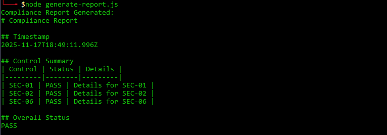

# Compliance App (Test Task)

## Project Overview

This project provides a security pipeline for container images. It includes Dockerfile linting, vulnerability scanning, and the ability to generate compliance reports based on various security checks.

## Features

- **Dockerfile Best Practices**: Ensures your Dockerfile follows security best practices.
- **Vulnerability Scanning**: Uses tools like Trivy, Gitleaks, and Dockle to scan for vulnerabilities in your container images.
- **Security Pipeline**: Integrates the checks and scans into a CI/CD pipeline using GitHub Actions.
- **Compliance Reporting**: Automatically generates compliance reports based on scan results.

## Installation

### Requirements

- **Docker**: Ensure Docker is installed and running.
- **Node.js**: Required for generating compliance reports and running the app.
- **GitHub**: Make sure you have a GitHub account and a repository set up.

### Setting Up the Project

1. **Clone the repository:**

```bash
git clone https://github.com/anakataa/compliance-app.git
cd compliance-app
```
2. **Install project dependencies:**
   
```bash
npm ci
```
3.**Build the Docker image:**
```bash
docker build -t compliance-app .
```
4.**Run the Docker container:**
```bash
docker run -p 3000:3000 compliance-app
```
Now your app will be accessible at http://localhost:3000


# What Each Tool Checks

## Gitleaks

Gitleaks a tool for detecting secrets** (such as API keys, passwords, and other sensitive data) in Git repositories.
What it checks:

- **Hardcoded secrets in the repository** (e.g., API keys, passwords).

- **Secrets in commit messages or files** in the repository.

- **Identifies secrets using predefined regular expressions, which can be configured.**

How to run:
```bash
gitleaks detect --source=./ --no-git
```

## Trivy

Trivy is a tool for scanning container images for vulnerabilities and misconfigurations.

What it checks:

- **Operating system vulnerabilities: Checks for known vulnerabilities in OS packages.**

- **Container image vulnerabilities: Scans for vulnerabilities in installed packages, dependencies, and libraries.**

- **Secrets: Trivy can also detect secrets such as keys and passwords in Docker images.**

- **Misconfigurations: Checks for configuration issues within the container.**

How to run:
```bash
trivy fs . --format json -o artifacts/trivy-fs.json
trivy image compliance-app --format json -o artifacts/trivy-image.json
```

## Dockle

Dockle is a linter for Docker images, which helps enforce best practices and security standards when building Docker images.

What it checks:

- **CIS Benchmarks: Checks for compliance with CIS Docker benchmarks.**

- **Best practices for Dockerfile: Reviews Dockerfile for adherence to best security practices (e.g., no root user, using COPY instead of ADD, etc.).**

- **Container security: Identifies security issues, such as the use of the latest tag, storing passwords in environment variables, and more.**

How to run:
```bash
dockle compliance-app --json > artifacts/dockle.json
```

## Syft

Syft is a tool for generating Software Bill of Materials (SBOM), which provides an inventory of all dependencies used in container images.

What it checks:

- **SBOM: Generates an inventory of all packages and dependencies in the Docker image.**

- **Identifies all libraries and package versions, helping track vulnerabilities and licensing issues.**

 How to run:
```bash
 syft compliance-app -o json > artifacts/sbom.json
```

## Explanation of allowlist in .gitleaks.toml

The allowlist in the .gitleaks.toml file is used to specify files, paths, or patterns that should not be flagged as containing secrets. This is important to prevent false positives in situations where secrets are intentionally stored in code, for example, in encrypted files or secure locations.

Why it's safe:

- **Intentional exceptions: The allowlist can be used to safely exclude patterns, files, or directories where secrets are deliberately stored in a secure manner.**

- **Prevents false positives: Excluding these files from scanning helps avoid situations where Gitleaks incorrectly flags secrets in files where they pose no threat.**

- **Controlled exclusions: It's crucial to configure the allowlist properly to prevent secrets from being stored in insecure locations.**

## How to Interpret artifacts/compliance-report.md

The report provides a summary of all checks performed by the different security tools. It contains the status of each check and details about the findings.

Report Structure

1.Timestamp: The time and date when the report was generated.

2.Control Summary: A table of results for each control.

- **Control: The name or ID of the control.**

- **Status: The result of the check (PASS or FAIL).**

- **Details: A brief explanation of what was checked.**

Example:

 

Overall Status: The overall result of the checks, either PASS if all checks passed, or NOT PASS if any check failed.


## Example Commands for Running Tools:

**1. Gitleaks:**
```bash
gitleaks detect --source=./ --no-git
```
**2. Trivy (Filesystem Scan):**
```bash
trivy fs . --format json -o artifacts/trivy-fs.json
```
**3. Trivy (Image Scan):**
```bash
trivy image compliance-app --format json -o artifacts/trivy-image.json
```
**4. Syft:**
```bash
syft compliance-app -o json > artifacts/sbom.json
```
